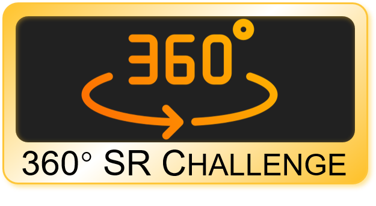

# NTIRE 2023: 360° Super-Resolution Challenge

<!--  -->

  

360° Super-Resolution Challenge is held as a part of the **[NTIRE workshop](https://cvlai.net/ntire/2023/)** in conjunction with **[CVPR 2023](https://cvpr.thecvf.com/)**.

📕[**Datasets**](https://360sr.github.io)  **|** 📝[Evaluation Script](https://github.com/360SR/360SR-Challenge/blob/main/scripts/cal_ws_metrics.py) **|** 🧑‍🤝‍🧑[比赛交流微信群](#-WeChat-Group)

---

👉 [Track 1：360° Omnidirectional Image Super-Resolution (X4)](#track-1360-omnidirectional-image-super-resolution-x4) **|** [Codalab server](https://codalab.lisn.upsaclay.fr/competitions/10319)

👉 [Track 2：360° Omnidirectional Video Super-Resolution (X4)](#track-2360-omnidirectional-video-super-resolution-x4) **|** [Codalab server](https://codalab.lisn.upsaclay.fr/competitions/10371)

## 🚩 News and Updates

- ✅ 2023-02-05. Codalab server is online: [Codalab server - image](https://codalab.lisn.upsaclay.fr/competitions/10319), [Codalab server - video](https://codalab.lisn.upsaclay.fr/competitions/10371)
- ✅ 2023-01-18. Training and validation sets are released.

## Introduction

The 360° or omnidirectional images/videos can provide an immersive and interactive experience and have received much research attention with the popularity of AR/VR applications. Unlike planar images/videos that have a narrow field of view (FoV), 360° images/videos can represent the whole scene in all directions. However, 360° images/videos suffer from the lower angular resolution problem since they are captured by fisheye lens with the same sensor size for capturing planar images. Although the whole 360° images/videos are of high resolution, the details are not satisfying. In many application scenarios, increasing the resolution of 360° images/videos is highly demanded to achieve higher perceptual quality and boost the performance of downstream tasks.

Recently, considerable success has been achieved in the image and video super-resolution (SR) task with the development of deep learning-based methods. Although 360° images/videos are often transformed into 2D planar representations by preserving omnidirectional information in practice, like equirectangular projection (ERP) and cube map projection (CMP), existing super-resolution methods still cannot be directly applied to 360° images/videos due to the distortions introduced by the projections. As for videos, the temporal relationships in a 360° video should be further considered since it is different from that in an ordinary 2D video. Therefore, how to effectively super-resolve 360° image/video by considering these characteristics remains challenging.

In this challenge, we aim to establish high-quality benchmarks for 360° image and video SR, and expect to further highlight the challenges and research problems. This challenge can provide an opportunity for researchers to work together to show their insights and novel algorithms, significantly promoting the development of 360° image and video SR tasks.

## Challenge Description

This challenge aims to reconstruct high-resolution (HR) 360° images/videos from degraded low-resolution (LR) counterparts.

Only the training and validation sets will be released **during the first phase (model construction period)**, and the HR and LR 360° image or video pairs are available for different tracks (360° image SR challenge and 360° video SR challenge). The participants can design their methods by considering the characteristics of 360° images/videos. Then these models can be trained on the training set and evaluated on the validation set. Note that the participants can use additional data, and the model size is not restricted.

**During the second phase (testing period)**, the testing set containing only LR 360° images/videos will be released. The participants can super-resolve the testing LR images/videos with their trained models. The super-resolved results should be submitted by the participants and then evaluated by the organizers with the quantitative metrics.

## Track 1：360° Omnidirectional Image Super-Resolution (X4)

### ● Dataset - Flickr360

To promote the development of this field, we construct a new 360° image dataset, which contains about 3150 ERP images with a resolution larger than 5k. Specifically, 3100 images are collected from Flickr, and the other 50 images are captured by Insta360° cameras. The images from Flickr are under either Creative Commons BY 2.0, Creative Commons BY-NC 2.0, Public Domain Mark 1.0, Public Domain CC0 1.0, or U.S. Government Works license. All of these licenses allow free use, redistribution, and adaptation for non-commercial purposes. The image contents vary both indoors and outdoors. We first downsample the original images into 2k resolution (2048 x 1024), serving as HR images. These HR images are further downsampled into LR images. The data partition is shown in the following table.

|         | Training              | Validation            | Testing              |
| ------- | --------------------- | --------------------- | -------------------- |
| Source  | Flickr 360            | Flickr 360            | Flickr 360+capturing |
| Number  | 3000                  | 50                    | 50+50                |
| Storage | 8.1G (HR) + 553M (LR) | 137M (HR) + 9.3M (LR) | 271M (HR) + 20M (LR) |

### ● Download

Google Drive：<https://drive.google.com/drive/folders/1lDIxTahDXQ5w5x_UZySX2NOes_ZoNztN>

腾讯微云：<https://share.weiyun.com/6p2fsaxO>

### ● Settings

Unlike previous settings that directly apply bicubic downsampling to generate low-resolution (LR) ERP images, we design a more realistic way to generate LR ERP images by considering the real acquisition process of 360° images. Since raw 360° images are captured by fisheye lens and are then saved as fisheye formats, thus performing degradations on fisheye images is more realistic and reasonable.

**Note that we do not provide degradation scripts during this challenge to avoid potential testing data leakage.**

### ● Metrics

We evaluate the super-resolved 360° images by comparing them to the ground truth HR ERP images. To measure the fidelity, we adopt the widely used Weighted-to-Spherically-uniform Peak Signal to Noise Ratio (WS-PSNR) as the quantitative evaluation metric.

## Track 2：360° Omnidirectional Video Super-Resolution (X4)

### ● Dataset - ODV360

To rectify the lack of high-quality video datasets in the community of omnidirectional video super-resolution, we create a new high-resolution (4K-8K) 360° video dataset, including two parts:

- 90 videos collected from YouTube and public 360° video dataset

    These videos are carefully selected and have high quality to be used for restoration. All videos have the license of Creative Commons Attribution license (reuse allowed), and our dataset is used only for academic and research proposes

- 160 videos collected by ourselves with Insta360 cameras

    The cameras we use include Insta 360 X2 and Insta 360 ONE RS. They can capture high-resolution (5.7K) omnidirectional videos.

These collected omnidirectional videos cover a large range of diversity, and the video contents vary indoors and outdoors. To facilitate the use of these videos for research, we downsample the original videos into 2K resolution (2160x1080) by OpenCV. The number of frames per video is fixed at about 100. We randomly divide these videos into training, validation, and testing sets, as shown in the following table.

|         | Training         | Validation        | Testing           | All   |
| ------- | ---------------- | ----------------- | ----------------- | ----- |
| Number (clips) | 210            | 20               | 20                | 250   |
| Storage | GT(59G)+LR(4.9G) | GT(5.3G)+LR(446M) | GT(5.7G)+LR(485M) | 75.8G |

### ● Download

Google Drive：<https://drive.google.com/drive/folders/1lDIxTahDXQ5w5x_UZySX2NOes_ZoNztN>

腾讯微云：<https://share.weiyun.com/8zd7X0TZ>

### ● Settings

In the process of generating low-resolution videos, we consider two main factors, i.e., downsampling and video compression. For downsampling, we apply the same pipeline as track 1. For video compression, we use the H.264 codec rules in FFMPEG to generate the compressed video frames.

Note that we do not provide degradation scripts during this challenge to avoid potential testing data leakage.

### ● Metrics

We evaluate the super-resolved 360° video frames by comparing them to the ground truth HR ERP frames. To measure the fidelity, we adopt the widely used Weighted-to-Spherically-uniform Peak Signal to Noise Ratio (WS-PSNR) as the quantitative evaluation metric.

## Submission

We use CodaLab for online submission in the development phase. Here, we provide an example (TBD) to help participants to format their submissions. In the test phase, the final results and the source codes (both training and test) need to be submitted. Please refer to our [online website](https://github.com/360SR/360SR-Challenge) for details of the submission rules.

## Important Dates

- 2023.01.30 Release of train data (input and output) and validation data (inputs only)
- 2023.01.30 Validation server online
- 2023.03.7 Final test data release (inputs only)
- 2023.03.14 Test output results submission deadline
- 2023.03.15 Fact sheets and code/executable submission deadline
- 2023.03.17 Preliminary test results release to the participants
- 2023.03.28 Paper submission deadline for entries from the challenge
- 2023.06.18 NTIRE workshop and challenges, results and award ceremony (CVPR 2023, Vancouver)

## Scripts

We provide some useful scripts:

- WS-PSNR evaluation
- sub-image cropping
- dataset loader

## FAQ

1.  We do not restrict competitors from using additional training data. If it is used, it is necessary to indicate the source and amount.

2.  We do not restrict competitors from using pretrained networks. If it is used, it is necessary to provide details.

3.  We do not restrict the model size and running time. Please provide them in the final submission.

### Organizers

Mingdeng Cao, Chong Mou, Fanghua Yu,
Xintao Wang, Yinqiang Zheng, Jian Zhang,
Chao Dong, Gen Li, Ying Shan, Radu Timofte

#### Acknowledgement

We use the GitHub README.md template from [Stereo SR competition](https://github.com/The-Learning-And-Vision-Atelier-LAVA/Stereo-Image-SR/tree/NTIRE2022)

## 🧑‍🤝‍🧑 WeChat Group

- **微信群**: NTIRE23-360超分比赛交流群 

   

